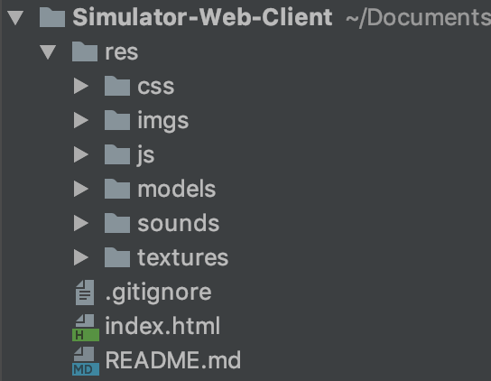
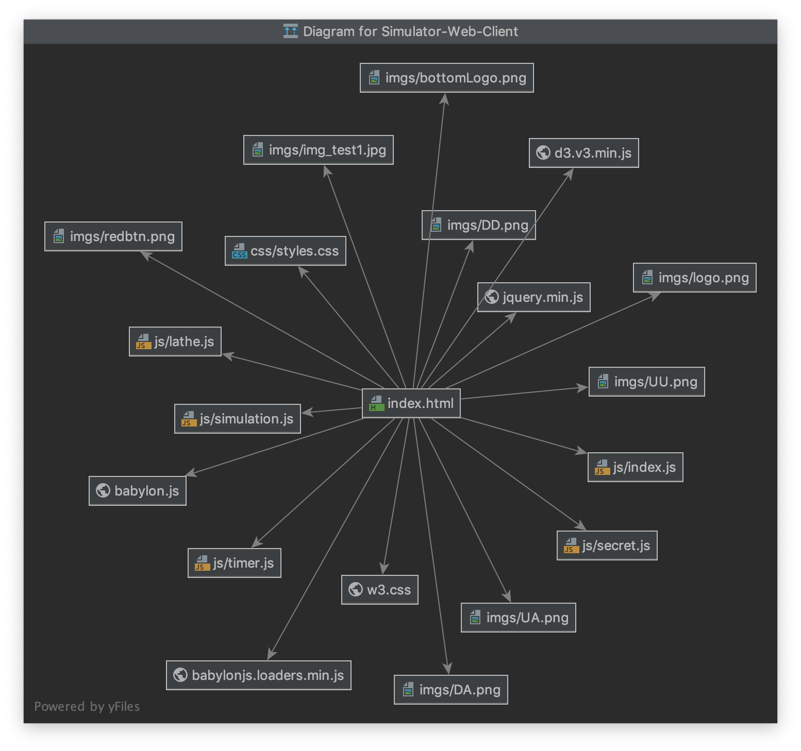
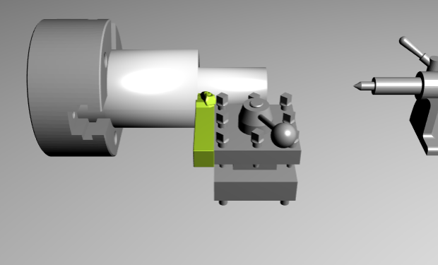
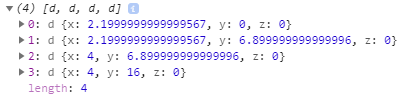
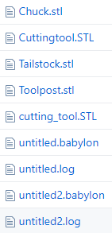
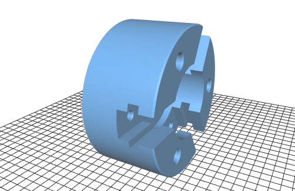
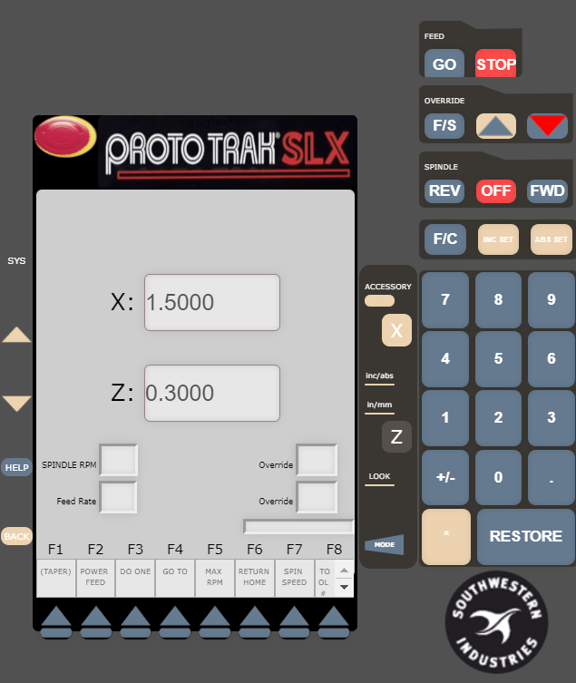
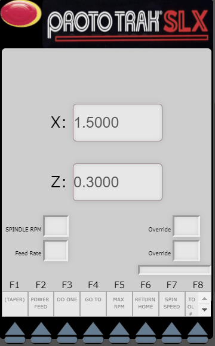
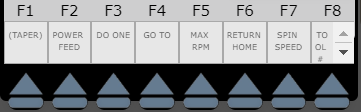

# Machine Shop Instruction Tool

## iPad Video Demonstration

[Demonstration Videoe](https://drive.google.com/file/d/1wyF8H9GCstwyCUIIQnRwZCqioPLVMXhw/veiw)

## Reports

Final presentation is [here](https://drive.google.com/file/d/1Gqapg8BMfww7YmNsWn6B0FYmWXulgj9G/view?usp=sharing).

Final executive summary is [here](https://drive.google.com/file/d/1asjiHTip52URC1OtZtzfzYedl_TPoRtv/view?usp=sharing).

Final report is [here](https://drive.google.com/file/d/1krl80qIfl8FWIimWT900HsaqoJIlVctc/view?usp=sharing).

Introduction
----

This code repository contains the client codes for the Machine Tool Simulator, which is an interactive learning tool to help the users to learn how to operate the lathe in the Machine Shop in order to be prepared for their future engineering projects.

The learning tool has three parts: (1) a series of videos taken by the team with the Thayer School Machine Shop manager Nicolas Edwards; (2) a 3D interactive simulated lathe which mimics the movement of the real lathe in the machine shop; (3) a controller which allows the users to input different parameters and commands to operate the simulated lathe.

In addition, the learning tool was deliberately designed with gamification mechanism. The users will be prompted with challenges with different difficulty levels and would only processed to the next level if he/ she completes the previous challenge successfully. While the 3D simulated lathe gives the users the freedom to try different cuttings, it also has certain failure states which address the safety concern. For example, the user would not be able to cut the object into half if the cutting edge is too close to the chuck.

However, it is important to know that this learning tool only provides basic knowledge about the lathe for the users. It is only a supplement of the in-shop teaching of the human being instructors, but not a replacement. [license here.] It is the user’s responsibility to follow different Machine Shop’s rules and ensure his/ her safety.


Lathe-3D
----
Frontend interactive client for the simulator.

Usage
----
- The software is currently hosted at the following url: https://machine-tool-simulator.github.io/Simulator-Web-Client/

- The user should follow the instructions on the left panel and watch each tutorial videos. The user will be prompted by the texts or the video to complete certain tasks. The tasks should be completed on the middle panel and right panel. For example, to turn and off the spindle by pressing the right buttons on the controller or to operate the wheels in the middle panel to move the cutting tool to a certain position.

- There is a hamburger bar on the top-left corner. The user can use it to have an overview of the tasks and navigate back to any tasks which they have completed to review if necessary. There is a function PlaylistVideo() in the index.js called which takes an integer and then present the corresponded videos and texts.

Implementation Notes
----
The following image shows an overview of the general structure of our code and the different directories that each of the components fall under.  The main webpage can be accessed using the index.html.  Below this image of the directories, another image is shown that displays the dependencies of the different code files on each other.

This image shows the directory structure:



This image shows a brief overview of the files that index.html (the top level page) depends on.



How does this structure implement the picture
Translate what is seen to the directory
Need to explain what functions are where and how different pieces of functionality are incorporated; what modules implement what functionality; how do these interact.

User Interface
----
- The user interface was designed to fulfill both the simplicity and functionality purposes.
- The three panels serving different goals are presented to users at the same time. The user could watch the videos, read the text instructions and operate the simulated or the controller. When they are working on the middle and right panel, if there is any confusions, they could always refer the left panel without shifting between the pages.
- In `index.html`, the three panels were split with `<div class="split left">`, `<div class="split middle">` and `<div class="split right">`. Under each div, the function calls were written and the CSS files were used for organizing the page.

Video/texts instruction
----
A major part of the course provided by this software is instructional videos and texts helping students understand the fundamentals of how to operating a lathe, extendable to other machineries in a typical machine shop. The pre-recorded videos provides basic knowledge of the lathe and how to accomplish simple tasks. The text instructions on certain pages will also include tasks for users to complete, implementations of which is discussed below, and the software a 3D simulated interface of the lathe for the user to operate on and complete such tasks.

3D simulator
----

*Introduction*

The 3D simulator is implemented using BabylonJS (see references for more information).  Before choosing BabylonJS, the team had already developed many components in HTML and Javascript.  Using BabylonJS, the team was able to leverage the existing work with the 3D simulation.  In addition, BabylonJS is compatible across browsers and requires minimal overhead for the user.  The 2D wheels for movement were created using D3.

The main files related to the 3D simulation can be found in the JS and models folder.  Under the “res” folder, “simulation.js” contains the code that is related to rendering the 3D model, as well as how the different 3D components are to interact with each other.

*BabylonJS Setup*

The main code that creates the BabylonJS rendering begins with the following snippet:

```javascript
window.addEventListener('DOMContentLoaded', function () {
    var canvas = document.getElementById('canvas');
    var engine = new BABYLON.Engine(canvas, true);
...
```

Before the interactions between the movement of the cutting tool and subsequent shape of the lathe material are specified, the following parameters are set up for BabylonJS rendering:
1. The 3D models are imported and the objects are initialized (ex. cutting tool, lathe, etc.)
2. The camera is setup
3. The light intensity and direction is specified
4. The ground and scene are rendered

*Lathe Shape*

The function `lathe_engine` dictates how the cutting tool is moved.  When the coordinates of the cutting tool overlap with those of the cutting material and the lathe is on, the shape of the material will be modified to reflect the part of the shape that has been cut out.  The inputs, delta_x and delta_z are the changes in the x and z direction for which the user would like to move the cutting tool.

As described, the shape that has been cut out is represented by an array of points.  Only the least possible points to represent the cut shape are stored.  For example, the following shape that has been cut out is represented by the array of inflection points shown to the right.

<p float="left">
  
   
</p>

*Movement of Cutting Tool*

The position of the cutting tool is controlled in three different ways in the code:
1. The 2D wheels which have been made using D3.  The dragOne and dragTwo functions dictate how the D3 wheels move and cause the cutting tool to move based on how the user has dragged either of these wheels.
2. The user can click on the window where the 3D simulation is displayed and then use the WASD keys to control the position of the cutting tool manually, as if the user was using the joystick.
3. There are also 3D tools within the simulation that can be used to control the placement of the cutting tool.  These wheels are rendered using BabylonJS.

*Models folder*

The 3D models that are referenced in the code are located in the models folder.  Generally, the 3D files are either STL or Babylon files because these were the most compatible with BabylonJS.   SolidWorks can be used to convert models of different formats to STL if necessary.  The following shows a listing of the different 3D models that were used as well as a rendering of just the chuck.

<p float="left">
  
   
</p>

*Interactions with Other Components*

BabylonJS is a great open source library to use for this web project because it can be written completely in JavaScript.  For this reason, it was possible for the HTML elements and Javascript elements that were outside of BabylonJS to reference these elements.  For example, if the user clicks “FWD” button on the control, which is rendered primarily using HTML and CSS, then it will cause the 3D chuck model to spin, like the actual lathe.  This behavior is possible even though the “FWD” button is outside of the main JavaScript file.

Control simulator
----


*Introduction*
The control simulator simulates the control display of the lathe, which allows users to implement different functions with the 3D simulation of the lathe. The control simulator is implemented using HTML, CSS, and Javascript. The layout of the control simulator was styled with CSS flexbox layout module. The flexbox layout module makes it easier to design a flexible, responsive layout structure without using float or positioning. 

The HTML codes related to the control simulator are inside the file index.html. To be more specific, the HTML codes that described the structure of the control simulator are inside the following div class: 

```html
<div class="split right" style="padding-top: 0px;">
…
</div>
```

The CSS code that describes the style of the control simulator are in the style.css file under the Simulator-Web-Client\res\css directory. The Javascript codes that enable interaction between the control simulator and 3D simulator are in the simulation.js file under the Simulator-Web-Client\res\JS directory. 

*Images folder*
The images that are used to create the control simulator, such as the Proto TrakSLX logo, are inside the Simulator-Web-Client\res\images folder. All of these images are in the PNG format. The PNG format is superior for images with text, such as buttons, icon, logos, and web comics.


*Functions*



The screen panel on the left displays the current position of the cutting tool in the 3D simulator. The coordinates shown in the X and Z windows will change accordingly when the users are moving the cutting tool using the wheels.



The list of the blue arrow buttons at the bottom of the screen panel controls the different functions that user can operate to the 3D simulator of the lathe. 

The functions that are currently available are:
**DO ONE (F3)**: Allowed users to cut the corner of the material in a 45-degree angle.
**GO TO(F4)**: Setting the GO TO function will disable the cutting tool to move further than the X and Z coordinates that users inputted.
**RETURN HOME(F6)**: Moved the cutting tool to the home position.
**SPINDLE SPEED(F7)**: Allowed users to set the spindle speed of the chuck. 

The primary codes that implemented these functions begin with the following snippet inside the simulation.js file:

```javascript
for (i = 0; i < GoTofunction.length; i++) {
            GoTofunction[i].addEventListener('click', function () {
…
}
```

Task checking
----
The simulation prevents users from advancing to the next step if they have not finished the designated tasks on the current page, accomplishing this by implementing an automatic task checking system. In the lathe.js file, where the course module information is stored, each page is appended a field including the tasks for the users to complete, if such tasks exist for the page. The tasks are in different formats including clicking, moving cutting tools, cutting certain shapes and so on. The example below showcases a page with tasks requiring users to click on three parts of the lathe in the order specified.
```javascript
let videos = [
    {
        "index":1,
        "title":"Title",
        "src":"Video link",
        "text":"Instructions",
        "tasks": [
            {
                "click": "tailstock"
            },
            {
                "click": "box"
            },
            {
                "click": "chuck"
            }
        ]
    },
];
```
Users’ activity and interaction on screen are tracked and used to determine whether the tasks are completed. Moreover, a “Skip” button is added for users to skip over tasks with which they have difficulties.

Maintenance Steps

For future development, developers can improve the software by adding additional functionalities to the lathe simulation, such as the power feed, max rpm, and tool number selection function.

The code is currently structured such that if future maintainers wish to add a certain feature or an entirely different machine in the machine shop, they can easily do so by using the same code format that is used right now and change only the user interface and the course data. The infrastructures such as the task checking system, video and text instruction flow can be kept and applied to other machines and modules with ease.

For adding or modifying the video and text instructions, maintainers should only need to modify the files that contain the module information (e.g. lathe.js) as the functional code and the data are separated into different files and should not impact each other as long as the format is kept the same. Using the example given above in the Task Checking subsection, should the user want to add another page/video to the course, he/she only needs to follow the same format and modify the content of certain blocks, e.g. the following instructions will be parsed into a new page which requires user to complete a task consisting of setting the RPM value to 500.
```javascript
    {
        "index":2,
        "title":"New title",
        "src":"New video link",
        "text":"New instructions",
        "tasks": [
    {
               "press":"RPM",
               "highlight":true
           },
           {
               "press":"INC_SET",
               "conditions":{
                   "buffer":500
               },
               "highlight":true
           },
        ]
    },
```
Adding courses even machines will follow similar steps.


Future Steps
----
It is possible that the 3D simulation could be incorporated with Oculus virtual reality glasses using the following guide for BabylonJS:

https://doc.babylonjs.com/how_to/webvr_camera

In addition, a list of feedback from users has been compiled into the following possible improvements for the web page in the future:

***High priority***
* Add alerts for if user does something wrong
    * Want to do more display for when things go wrong
* Fix grammar in text; split up into sections with better formatting
* Add textual encouragement
    * Can look at wearables; a lot of research has shown that positive encouragement helps the user

***Middle priority***
* Add a progress bar at the bottom
* Make it so skip only applies to the hardest pages
    * This is bad if you can’t verify that the user
    * Could possibly have the user come back to the page; can either make them come back or give them the answer
    * User might have misunderstood the question; it is not ideal, we want them to physically do it; could also look at other practices for training modules if people cannot get through

***Low priority***
* Instruction should be more clear for setting x / z direction for how it translates to real life
* People had trouble setting x-coordinate system based on the tool
* Maybe echo what person is doing wrong back to the user through the alert (ex. Click tailstock, click cutting tool, etc.) - people want to know what is missing
* Possibly add multiple choice quizzes
* Add functionality for user to cut shape down at once
* Make background more realistic using BabylonJS editor
* Look into sections resetting online when they do not have to
* Do something with how to use calipers in the simulation

References (Other Libraries)
----
BabylonJS (for 3D simulation) - https://www.babylonjs.com/

D3 (for wheels) - https://d3js.org/

Prototrak (control resembles this real controller) - https://www.southwesternindustries.com/
